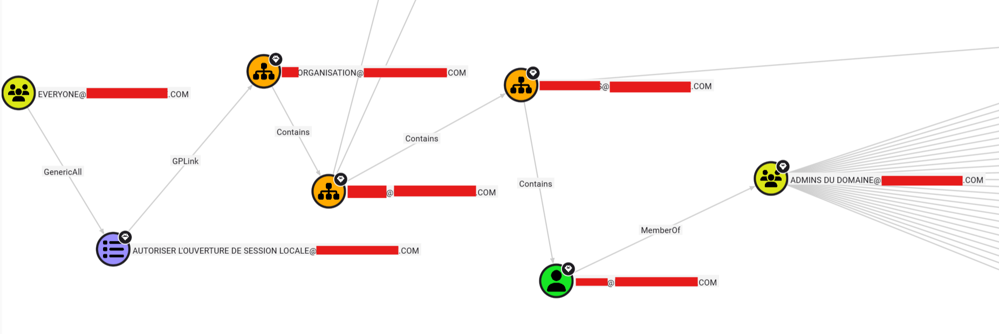
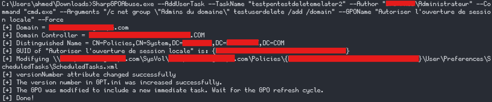
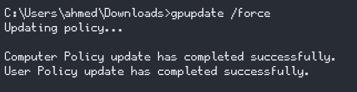
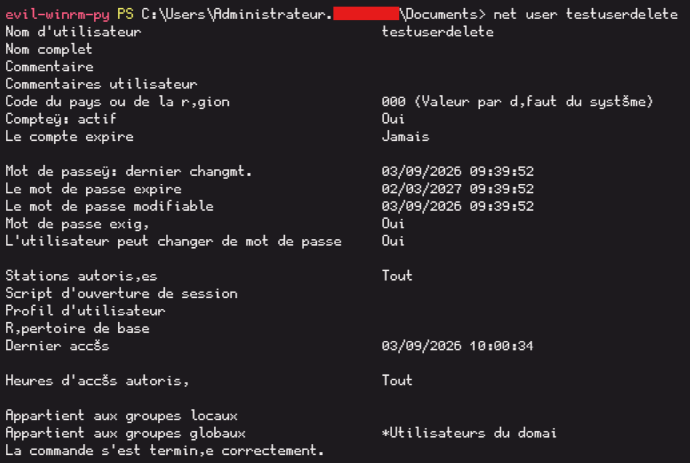
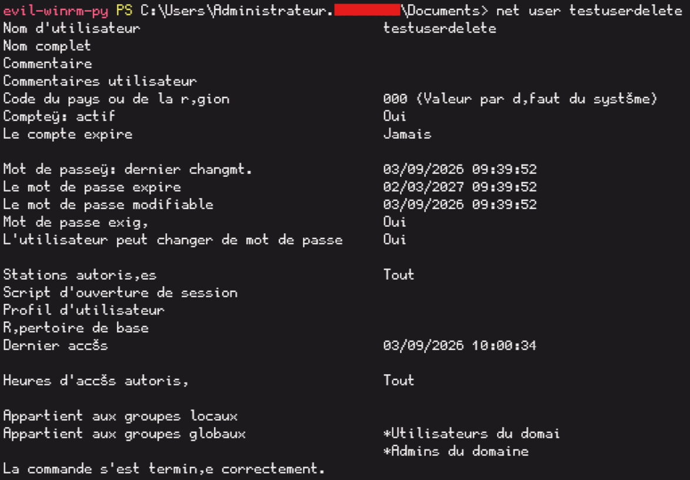

When a GPO is configured with the **GenericAll** permission, it allows a user to modify the GPO and add a malicious script that will be executed on all computers that apply the GPO. This can be used to escalate privileges in an Active Directory environment.

## The setup

BloodHound flagged a shortest path from Domain Users to a High Value Target




Translated: the built-in Everyone principal has GenericAll on a Group Policy Object, that GPO is linked to an OU, and one of the users living in that OU happens to be a Domain Admin. If you can write to the GPO, you can push arbitrary settings — including code execution — to anything or anyone in its scope. And "anything or anyone" here includes a Domain Admin's own logon session.


## Exploit

Creating a fresh test account:

```
net user testuserdelete P@ssw0rdTESTd3l3t3! /add /domain
```

open session as new account 

```
runas /netonly /user:REDACTED.COM\testuserdelete cmd.exe
```

Now we use SharpGPOAbuse.exe to add a task that adds our user to the Domain Admins group. The command is as follows:






Our account privileges before the GPO modification:



And now after the GPO modification:



# Defensive takeaway:

Everyone/Authenticated Users should never appear with write-level rights (GenericAll, GenericWrite, WriteDacl, WriteOwner) on any GPO, full stop — GPOs are Tier 0 infrastructure by nature of what they can push to their scope. Separately, privileged accounts (Domain Admins, Tier 0 in general) should live in dedicated, tightly-scoped OUs with no unnecessary GPOs linked, specifically to prevent exactly this kind of "innocuous OU membership becomes a privilege escalation vector" scenario.