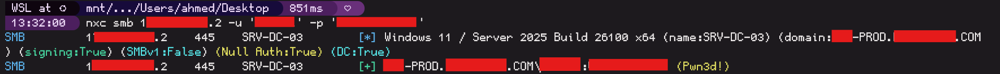
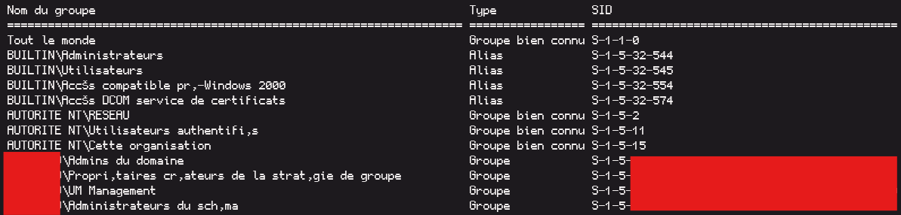

I kinda abandoned this blog for a while, trying to stay consistent now.

## Context

In a recent pentest engagement, I was able to gain access to an account with **Domain Admin** privileges. 

That by itself isn't that impressive or interesting, but the way it was achieved and the speed at which it was done, I think is worth sharing.


## Recon

Just like any other pentest, I started with the usual recon, the client demanded that we begin without initial access to the active directory environment, so no credentials were provided.

My usual first step is to nmap the scope to get a general idea about the environment.

```
nmaps -p- -iL targets.txt -oA scan_results_all
```
**nmaps** is an alias I use.

This is a truncated/redacted result on one of the servers:

```
Host is up (0.021s latency).
Not shown: 65502 filtered tcp ports (no-response)
PORT      STATE  SERVICE          VERSION
53/tcp    open   domain           Simple DNS Plus
88/tcp    open   kerberos-sec     Microsoft Windows Kerberos (server time: 2026-08-27 09:55:33Z)
113/tcp   closed ident
135/tcp   open   msrpc            Microsoft Windows RPC
139/tcp   open   netbios-ssn      Microsoft Windows netbios-ssn
389/tcp   open   ldap             Microsoft Windows Active Directory LDAP (Domain: ...-PROD.....COM0., Site: ...)
| ssl-cert: Subject: commonName=SRV-DC-03...-PROD.....COM
| Subject Alternative Name: othername: 1.3.6.1.4.1.311.25.1::<unsupported>, DNS:SRV-DC-03...-PROD.....COM
| Not valid before: 2026-07-01T11:03:25
|_Not valid after:  2027-07-01T11:03:25
|_ssl-date: TLS randomness does not represent time
445/tcp   open   microsoft-ds?
464/tcp   open   kpasswd5?
.
.
.
```

Ok, so this appears to be the domain controller, good.

But what next? With no credentials, I can't really do much, I checked all the other servers in the scope for any other issues that could potentially lead us to a foothold, and while I did find some interesting things, nothing really helped with the AD initial access.

I was about to call for the client to provide some credentials, but then I remembered something that I had used in the past, but it rarely ever worked.

That thing was checking for exposed credentials in public leaks/breaches, I searched for the domain **redacted.com** and got a result!

There were a few emails that came back, they were affected by info stealers, some of them as old as 2017, which wasn't promising, but I decided to try them anyway, I had nothing to lose.

As luck would have it, the last one I tried was the one that worked, so now I have a valid user account, nice!



Let's check our account privileges:




It's over...


Turns out that a domain admin had his credentials leaked in a stealer log, If i had searched for it from the start, I would have had access to the domain admin account in a matter of minutes, but I didn't know that at the time.

Lesson learned, always check for leaked credentials early, it can save you a lot of time and effort.